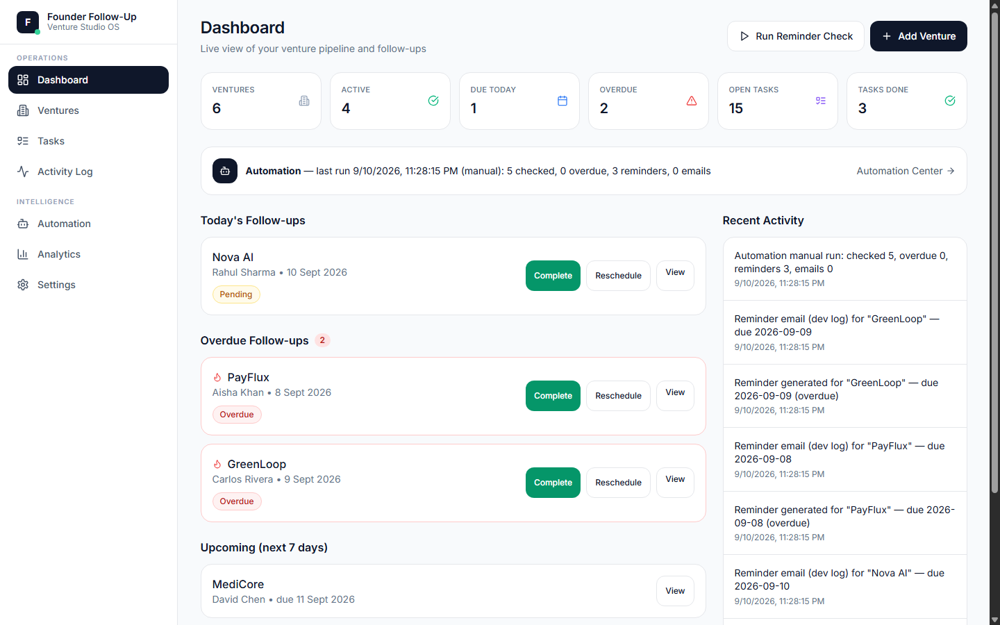
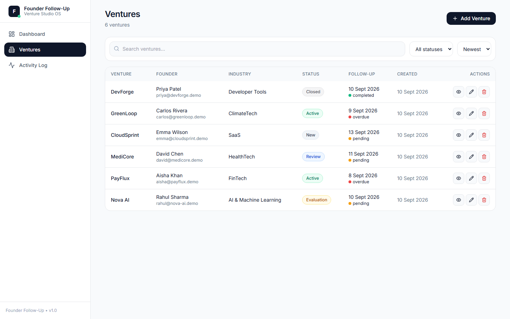
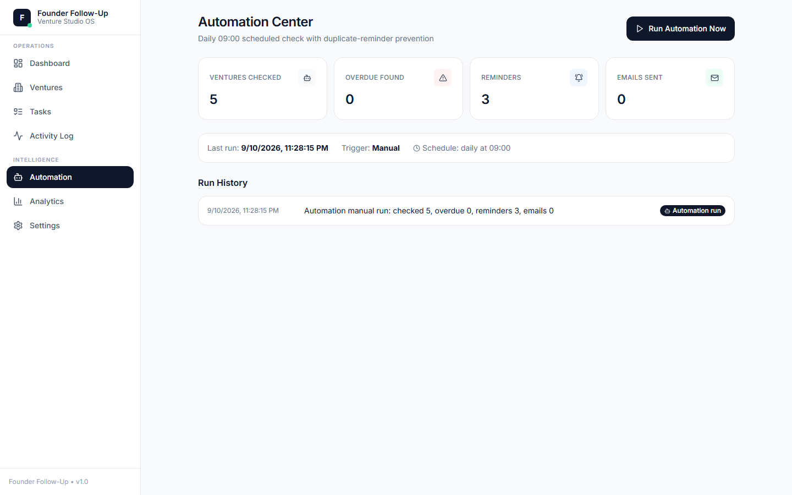
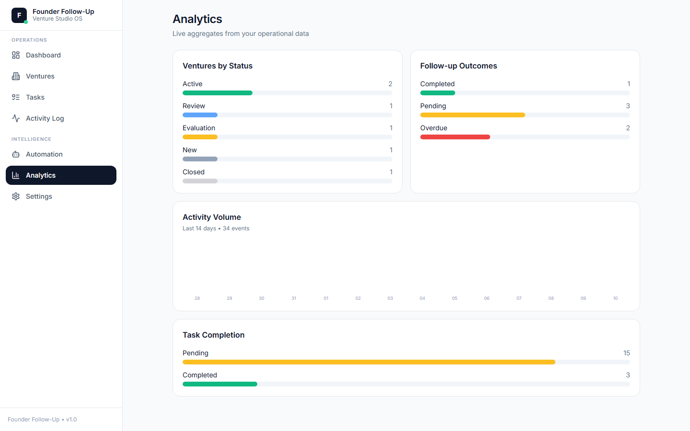
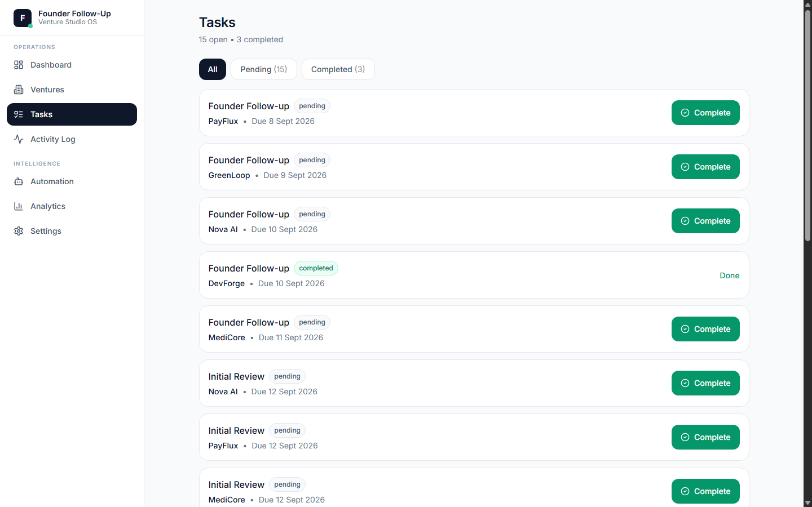
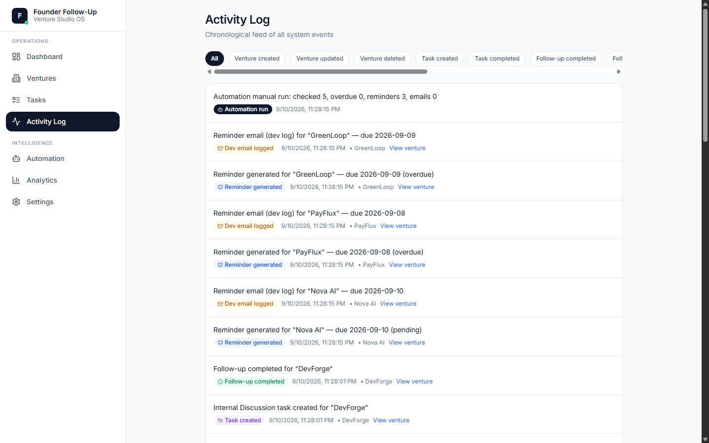
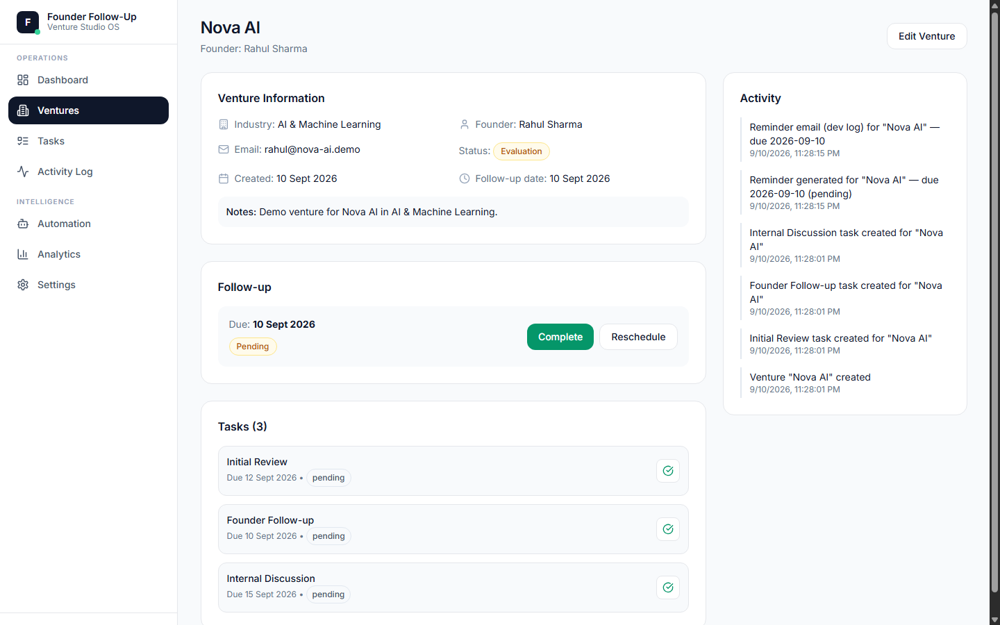
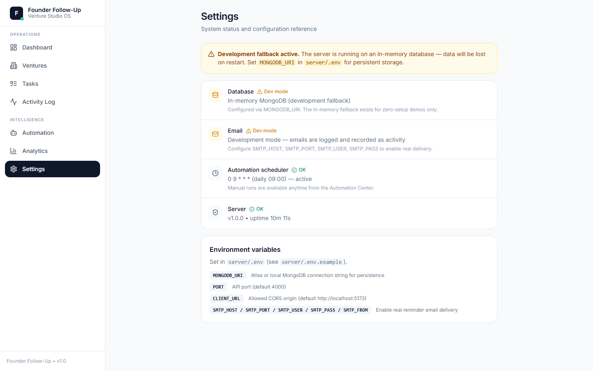
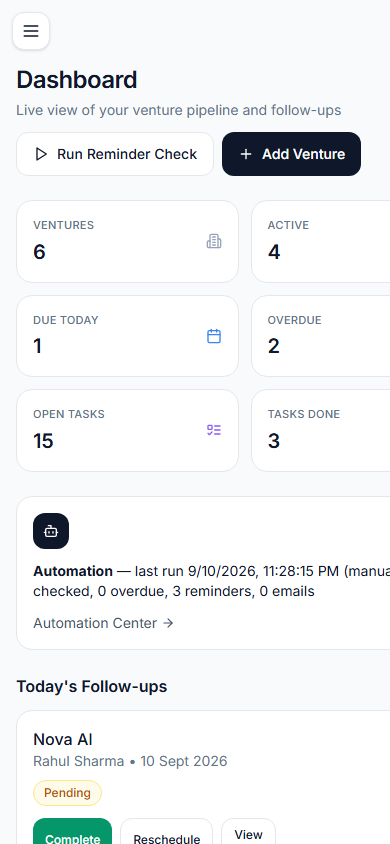
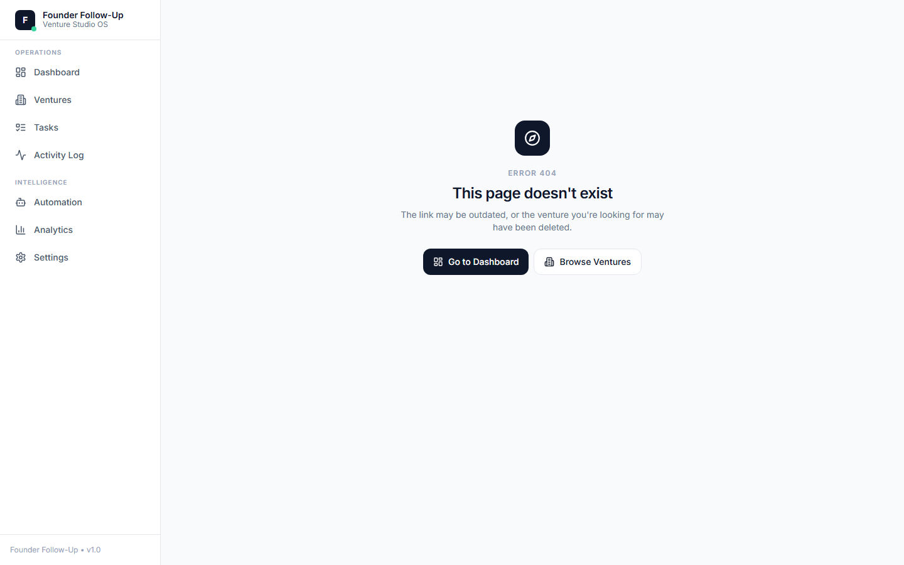

# Founder Follow-Up — Venture Studio OS

An internal operations platform for venture studios: track portfolio ventures, automate founder follow-ups, generate reminder emails, and keep a complete activity trail — so no founder conversation slips through the cracks.



> **Docs:** [Project Overview](PROJECT_OVERVIEW.md) • [Architecture](ARCHITECTURE.md) • [API Documentation](API_DOCUMENTATION.md) • [Testing](TESTING.md)

## Why this exists

Venture studios juggle dozens of founder relationships. Each venture needs an initial review, a founder follow-up, and an internal discussion — and every one of those needs a human to remember it. This system makes the follow-up itself automatic: ventures are created with tasks pre-generated, due dates are tracked, overdue items are flagged, and reminder emails go out on schedule (or on demand) with duplicate protection.

## Features

- **Authentication** — email/password signup and login (bcrypt-hashed), 7-day JWT sessions, "remember me" persistence, session restore on refresh, clean logout
- **Venture pipeline** — full CRUD with search, status filter and sorting; desktop table and mobile card views
- **Auto-generated tasks** — every new venture gets Initial Review, Founder Follow-up and Internal Discussion tasks
- **Follow-up automation** — daily cron plus on-demand check; marks overdue items, generates reminders, sends emails (SMTP or dev log), with one-reminder-per-venture-per-day duplicate prevention
- **Rescheduling** — reschedule a follow-up and the venture's date stays in sync
- **Activity trail** — every meaningful action (creation, completion, reschedule, reminder) is logged and browsable
- **Dashboard** — 6 live KPIs, today's/overdue/upcoming follow-ups with inline actions, automation summary, recent activity
- **Automation Center** — run history, last-run metrics, one-click manual trigger
- **Analytics** — ventures by status, follow-up outcomes, task completion, 14-day activity volume (all real aggregates)
- **Tasks** — cross-venture task list with completion
- **Settings** — honest system status (DB mode, email mode, cron state)
- **Polished UX** — loading skeletons, empty states, confirmation dialogs, toast notifications, per-page titles, favicon, 404 page, keyboard/ARIA accessibility, responsive down to 320px

## Tech Stack

| Layer | Tools |
|---|---|
| Frontend | React 18, TypeScript, Vite, Tailwind CSS 3, React Router 7, Lucide icons |
| Backend | Node 22, Express 4, TypeScript, Mongoose 8, bcryptjs, jsonwebtoken |
| Database | MongoDB (Atlas / local) with automatic in-memory fallback for zero-setup demos (development only) |
| Automation | node-cron (daily 09:00) + manual trigger endpoint |
| Email | Nodemailer with dev-mode console log when SMTP is unconfigured |
| Testing | Vitest + Supertest (unit + full E2E API workflow) |

## Architecture

```
┌─────────────────────────────────────────────────────────────────────┐
│                              CLIENT                                 │
│  React SPA (Vite)                                                   │
│  pages/ ── components/ ── api/client.ts ── fetch("/api/...")        │
└──────────────────────────────┬──────────────────────────────────────┘
                               │ REST (JSON, proxied in dev)
┌──────────────────────────────▼──────────────────────────────────────┐
│                              SERVER                                 │
│                                                                     │
│  routes/  ──►  controllers/  ──►  services/  ──►  models/ (Mongoose)│
│                  │ validation          │                            │
│                  │ utils/http.ts       ├─► automationService        │
│                  │ (asyncHandler,      │    checkDueFollowUps()     │
│                  │  HttpError)         └─► emailService            │
│                                          sendReminderEmail()        │
│  jobs/cron.ts ──► checkDueFollowUps()  (same service as manual)     │
│                                                                     │
│  Central error handler: every failure → predictable JSON status     │
└──────────────────────────────┬──────────────────────────────────────┘
                               │
                    ┌──────────▼───────────┐
                    │       MongoDB        │
                    │  Atlas / local, or   │
                    │  in-memory fallback  │
                    └──────────────────────┘
```

**Automation flow** (cron 09:00 daily, or `POST /api/automation/check-followups`):

```
node-cron / manual trigger
   ↓
checkDueFollowUps()
   ↓
find pending + overdue follow-ups
   ↓
mark newly-overdue → activity
   ↓
duplicate check (one reminder per venture per due-day)
   ↓
generate reminder → activity
   ↓
send email (SMTP) or dev-log → activity
```

## Quick Start

```bash
# 1. Backend
cd server && npm install
npm run dev          # http://localhost:4000  (health: /api/health)

# 2. Frontend (new terminal)
cd client && npm install
npm run dev          # http://localhost:5173
```

With no environment variables set, the server spins up an **in-memory MongoDB** — perfect for demos, but data resets on restart.

## Environment Variables

Copy `server/.env.example` to `server/.env` (and `client/.env.example` to `client/.env` for production API URLs).

### Development (defaults are safe to run as-is)

```bash
NODE_ENV=development  # dev fallbacks enabled: see below
MONGODB_URI=            # optional; Atlas or local MongoDB for persistence
JWT_SECRET=             # optional locally; insecure dev fallback is used
PORT=4000
CLIENT_URL=http://localhost:5173
SMTP_HOST=              # optional; leave empty for dev-mode email logging
SMTP_PORT=587
SMTP_USER=
SMTP_PASS=
SMTP_FROM=
ALLOW_SEED=             # leave unset; only relevant in production
```

With no environment variables set, the server spins up an **in-memory MongoDB** — perfect for demos, but data resets on restart. The Settings page and `GET /api/system` always report the actual mode, and the UI never claims persistence or email delivery it doesn't have.

### Production (all required — the server refuses to boot without them)

| Variable | Requirement |
|---|---|
| `NODE_ENV=production` | Enables strict mode (see below) |
| `MONGODB_URI` | Atlas or secured self-hosted MongoDB. No in-memory fallback; an unreachable DB fails startup instead of silently losing data |
| `JWT_SECRET` | Minimum 32 random characters. Missing or weak values fail startup. Generate: `node -e "console.log(require('crypto').randomBytes(48).toString('hex'))"` |
| `CLIENT_URL` | Exact origin of the deployed frontend (e.g. `https://app.example.com`). No localhost fallback in production |
| `VITE_API_URL` (client) | Production API base URL (e.g. `https://api.example.com`). Leave empty locally — Vite proxies `/api` to `http://localhost:4000` |
| `SMTP_*` | Only when real delivery is wanted. Without them, reminders are console-logged and recorded as `reminder_email_dev` — never reported as sent |
| `ALLOW_SEED=true` | Only to deliberately unlock `POST /api/seed` in production. Otherwise the endpoint returns 403 (it always requires a session token regardless) |

Production also: returns generic `Internal server error` messages (details stay server-side), sends baseline security headers, and keeps the JSON 404 and validation-error shapes unchanged.

### Connecting MongoDB Atlas

1. Create a free cluster at [mongodb.com/atlas](https://www.mongodb.com/atlas) and get your connection string.
2. Set `MONGODB_URI` in `server/.env`, restart the server — logs should say `[DB] Connected to MongoDB`.
3. **Persistence test:** start the server → create a venture → stop the server → start it again → verify the venture still exists. That confirms you're off the in-memory fallback.

## API Reference

Base URL: `http://localhost:4000`

All endpoints return JSON. Errors are predictable: `{ "error": string }` and, for validation failures, `{ "error": "Validation failed", "details": string[] }`.

| Method | Path | Auth | Description |
|--------|------|------|-------------|
| GET | `/api/health` | No | Health check |
| POST | `/api/auth/register` | No | Create account `{ name, email, password }` → 201 `{ token, user }` |
| POST | `/api/auth/login` | No | Sign in → 200 `{ token, user }` (generic error, no enumeration) |
| GET | `/api/auth/me` | Yes | Current session user |
| PUT | `/api/auth/password` | Yes | Change password `{ currentPassword, newPassword }` |
| GET | `/api/ventures` | Yes | List ventures — `?search=&status=&sort=newest\|oldest` |
| POST | `/api/ventures` | Yes | Create venture (+ 3 auto tasks + follow-up) |
| GET | `/api/ventures/:id` | Yes | Venture detail + follow-up + tasks + activity |
| PUT | `/api/ventures/:id` | Yes | Update venture (syncs open follow-up date) |
| DELETE | `/api/ventures/:id` | Yes | Delete venture + cascade follow-ups/tasks/activity |
| GET | `/api/ventures/:id/activity` | Yes | Activity for one venture |
| GET | `/api/followups` | Yes | List follow-ups — `?status=pending\|completed\|overdue` |
| POST | `/api/followups` | Yes | Create follow-up `{ ventureId, dueDate }` |
| PUT | `/api/followups/:id/complete` | Yes | Mark completed (idempotent) |
| PUT | `/api/followups/:id/reschedule` | Yes | Reschedule `{ dueDate }` |
| GET | `/api/tasks` | Yes | List tasks — `?ventureId=` |
| POST | `/api/tasks` | Yes | Create task `{ ventureId, title, dueDate? }` |
| PUT | `/api/tasks/:id/complete` | Yes | Mark completed (idempotent) |
| GET | `/api/activity` | Yes | Global activity feed (`?limit=`, max 200) |
| GET | `/api/dashboard` | Yes | Stats + today's follow-ups + recent activity |
| GET | `/api/dashboard/stats` | Yes | Stats only |
| GET | `/api/analytics` | Yes | Real aggregates + 14-day activity volume |
| GET | `/api/system` | Yes | Honest runtime status (DB/email/cron/uptime) |
| POST | `/api/automation/check-followups` | Yes | Run follow-up check now |
| POST | `/api/seed` | Yes | Load demo data (6 ventures). Destructive; 403 in production unless `ALLOW_SEED=true` |
| GET | `/api/anything-else` | Yes | JSON 404 — no HTML error pages |

Auth uses `Authorization: Bearer <token>` (7-day JWT). Expired/invalid tokens → `401`, and the client signs out cleanly.

## Demo Workflow

This is the end-to-end flow the E2E test suite verifies:

1. **Create Venture** → 3 tasks auto-created, follow-up created, activity logged
2. **Dashboard** reflects new stats and today's follow-ups
3. **Open venture** → complete a task → activity generated (idempotent)
4. **Reschedule follow-up** → venture date synced, activity generated
5. **Make it overdue** → **Run Reminder Check** → overdue flagged, reminder generated, email dev-logged
6. **Run again** → no duplicate reminder
7. **Delete venture** → follow-ups, tasks, and activities cascade-deleted

Run it yourself: `cd server && npm test`

## Screenshots

| | |
|---|---|
|  |  |
|  |  |
|  |  |
|  |  |
|  |  |

## Testing

```bash
cd server && npm test     # unit + E2E API tests (Vitest + Supertest, in-memory Mongo)
```

63 tests cover: auth (register/login/session/password-change/401 handling), production guards (JWT/CORS/seed/headers/error shape), validation and error shapes, venture creation with auto-tasks, task/follow-up completion idempotency, rescheduling, overdue detection, duplicate reminder prevention (including cron↔manual consistency), email success/failure/dev-log paths, automation exception propagation, dashboard stats, cascade delete, and the full step-by-step demo workflow above.

## Project Structure

```
client/
  src/
    api/client.ts        # typed fetch wrapper + token storage + 401 handling
    components/          # Modal, ConfirmDialog, Toast, Skeleton, EmptyState…
    hooks/usePageTitle   # per-page document titles
    pages/               # Dashboard, Ventures, VentureForm, VentureDetails,
                         # Tasks, Automation, ActivityLog, Analytics,
                         # Settings, Login, Signup, NotFound
server/
  src/
    app.ts               # Express app (security headers, CORS, routes, seed guard, error handler)
    server.ts            # env-validated DB connect + listen + graceful shutdown
    routes/              # auth, ventures, followups, tasks, activity, dashboard, automation, analytics, system
    controllers/         # request handling + validation
    services/            # automationService, emailService
    models/              # User, Venture, FollowUp, Task, Activity (Mongoose)
    jobs/cron.ts         # daily 09:00 reminder check (same service as manual trigger)
    middleware/          # requireAuth, security headers
    tests/               # unit + E2E API tests (auth, automation, e2e workflow, security)
    utils/               # http helpers, validators, env/production guards
```

## Production Deployment Checklist

- [ ] `NODE_ENV=production`, `MONGODB_URI` (persistent), `JWT_SECRET` (32+ random chars), `CLIENT_URL` (exact frontend origin) all set — the server refuses to boot otherwise
- [ ] Client built with `VITE_API_URL` pointing at the API; frontend served over HTTPS
- [ ] `GET /api/system` reports `db.mode: "mongodb"` with `persistent: true`
- [ ] SMTP variables set only if real founder emails are wanted; otherwise confirm dev-log mode is understood
- [ ] `POST /api/seed` left locked (no `ALLOW_SEED`) unless a deliberate demo reset is needed
- [ ] MongoDB backups scheduled (see below) and a restore tested once
- [ ] Single backend instance (node-cron runs in-process; do not horizontally scale without externalizing the schedule)

### MongoDB backup / restore (minimum procedure)

```bash
# Backup (Atlas: use the cloud backup/snapshot UI on the same schedule)
mongodump --uri="$MONGODB_URI" --out=./backup-$(date +%F)

# Restore into a target database
mongorestore --uri="$MONGODB_URI" --nsInclude="founder-followup.*" ./backup-YYYY-MM-DD/founder-followup
```

Recommended: daily automated snapshots with 7-day retention for a private beta; verify restores against a staging database, never by overwriting production untested.

## Limitations

This is an academic/prototype operations system — functional for local MVP and private-beta use, not an enterprise product.

- Single tenant, no roles — any signed-in user sees and edits all data
- No rate limiting on auth or automation endpoints
- Lists are capped (dashboard 10, activity 200/request) — no pagination UI
- Venture updates require the full object (no PATCH)
- Reminder dedupe is description-based, not atomic — overlapping concurrent runs could theoretically duplicate a reminder (documented in code; the daily cron and manual runs do not overlap in practice)
- node-cron runs in-process — correct for a single backend instance only
- Email without SMTP is console-logged and recorded as `reminder_email_dev` activity — delivery is never claimed unless SMTP actually sends
- Dependency advisories: server and client audit clean at last check (`npm audit` — 0 vulnerabilities). Server pins `qs` to patched 6.16.x via npm `overrides`
